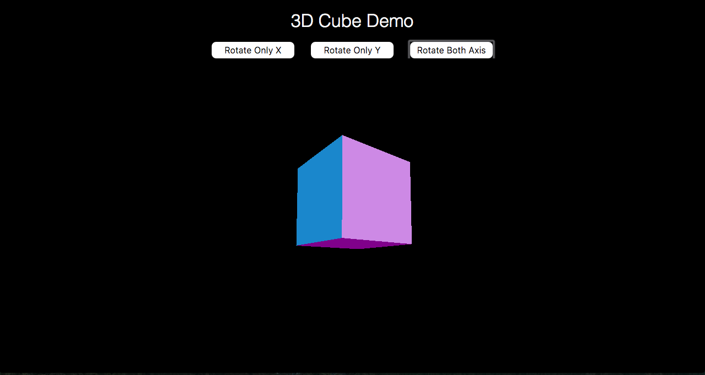

# JavaScript 3D Animations

After working with the brick breaker game that I recently created, I was curious to see if there was a possibility to do 3D rendering and I stumbled upon the JavaScript extension, three.js. This sparked my interest, and decided to make a small demo that renders a cube spinning around in void space. You can spin the cube in its x-axis, y-axis, and both at the same time.

It was lots of fun learning about how three.js works, and what capabilities someone has using this extension.

All of the source code is embedded in the html.

A screenshot of the webpage looks like: 

